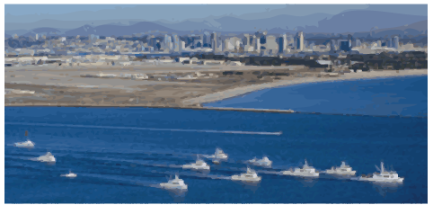

flotilla
========

What is flotilla?
=================

`flotilla` is a Python package for visualizing transcriptome (RNA expression) data from hundreds of
samples. We include utilities to perform common tasks on these large data matrices, including:
 
  * Dimensionality reduction
  * Classification and Regression
  * Outlier detection
  * Network graphs from covariance
  * Hierarchical clustering
  
And common tasks for biological data including:

  * Renaming database features to gene symbols
  * Coloring/marking samples based on experimental phenotype
  * Removing poor-quality samples (technical outliers)
  
  
Finally, `flotilla` is a platform for active collaboration between bioinformatics scientists and 
traditional "wet lab" scientists. Leveraging [interactive widgets](https://github.com/ipython/ipython/tree/master/examples/Interactive%20Widgets) 
in the [iPython Notebook](http://ipython.org/notebook.html), 
we have created tools for simple and streamlined data exploration including:

  * Subsetting sample groups and feature (genes/splicing events) groups
  * Dynamically adjusting parameters for analysis
  * Integrating external lists of features from the web or local files

These empower the "wet lab" scientists to ask questions on their own and gives bioniformatics
scientists a platform and share their analysis tools.

What flotilla is **not**
========================

`flotilla` is not a genomics pipeline. We expect that you have already generated
data tables for gene expression, isoform expression and metadata. `flotilla` only makes 
it easy to integrate all those data parts together once you have the pieces.

Learn how to use flotilla
=========================
Please refer to our [talks](talks.md) to learn more
 about how you can
apply our tools to your data.

Installation
============

Docker Installation Instructions
--------------------------------

[Docker](https://www.docker.com/whatisdocker/) is the preferred method to obtain the most up-to-date
version of `flotilla`. Every change we make to the source code triggers a new build of a virtual
 machine that contains flotilla and all its dependencies.
 
Please follow instructions [here](docker/docker_instructions.md) to get, install, and run the `flotilla` image.

Local install (on your computer)
--------------------------------

To install, first install the 
[Anaconda Python Distribution](http://continuum.io/downloads), which comes
pre-packaged with a bunch of the scientific packages we use all the time, 
pre-installed.

### Create a Flotilla sandbox
    
We recommend creating a "sandbox" where you can install any and all packages
without disturbing the rest of the Python distribution. You can do this with

    conda create --yes flotilla_env pip numpy scipy cython matplotlib nose six scikit-learn ipython networkx pandas tornado statsmodels setuptools pytest pyzmq jinja2 pyyaml

You've now just created a "virtual environment" called `flotilla_env` (the first
argument). Now activate that environment with,

    source activate flotilla_env

Now at the beginning of your terminal prompt, you should see:

    (flotilla_env)

Which indicates that you are now in the `flotilla_env` virtual environment. Now
 that you're in the environment, follow along with the non-sandbox
installation instructions.

### Install and update all packages in your environment

To make sure you have the latest packages, on the command line in your 
terminal, enter this command:

    conda install --yes --file conda_requirements.txt
    conda install --yes pip

Not all packages are available using `conda`, so we'll install the rest using
`pip`, which is a Python package installer and installs from 
[PyPI](https://pypi.python.org/), the Python Package Index.

    pip install -r requirements.txt
    
Next, to install the latest release of `flotilla`, do

    pip install flotilla
    
If you want the bleeding-edge master version (that we work really hard to make
sure it's always working but could be buggy!), then install the `git` master
with,

    pip install git+git://github.com/yeolab/flotilla.git

Test dataset
============

We have prepared a slice of the full dataset for testing and demonstration purposes.

Run each of the following code lines in its own ipython notebook cell for an interactive feature.

    import flotilla
    study = flotilla.embark(flotilla._shalek2013)

    study.interactive_pca()

    study.interactive_graph()

    study.interactive_classifier()

    study.interactive_lavalamp_pooled_inconsistent()

IMPORTANT NOTE: for this test,several failures are expected since the test set is small.
Adjust parameters to explore valid parameter spaces.
For example, you can manually select `all_genes` as the `feature_subset`
from the drop-down menu that appears after running these interactive functions.

Problems? Questions?
====================

We invite your input! Please leave any feedback on our [issues page](https://github.com/YeoLab/flotilla/issues).

Proudly sponsored by a NumFOCUS John Hunter Technical Fellowship to Olga
Botvinnik.
